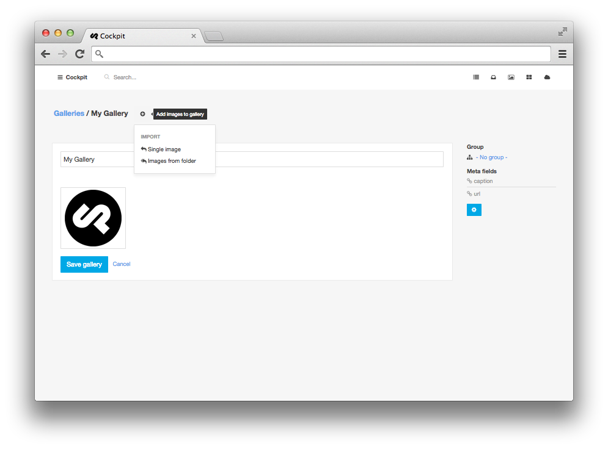

### Galleries

Create a collection of selected images to reuse them for portfolios etc.



#### Access gallery data (array of images) on your site:

    <?php $images = cockpit("galleries")->gallery('galleryname'); ?>

Or use the shortcut function:

    <?php $images = cockpit('galleries:gallery','galleryname'); ?>


#### Loop through images:

    <?php foreach(gallery('galleryname') as $image): ?>

        <?php thumbnail($image["path"], 100, 100) ?>

    <?php endforeach;?>

---

## Module API


##### gallery( $name )

Get gallery data containing image paths and meta field information.

```
// get gallery data
$gallery = cockpit('galleries:gallery', 'galleryname');
```

---

##### galleries( $options = [] )

Get multiple galleries.

```
// get gallery data
$galleries = cockpit('galleries:galleries', [
    'filter' => ['name'=>['$in'=>['gal1','gal2']]]
]);
```

---

##### group( $group, $sort = null )

Get all galleries in a group.

```
// get gallery data
$galleries = cockpit('galleries:group', 'groupname');
```

---

##### get_gallery_by_slug( $slug )

Get a gallery by its slug.

```
// get gallery data
$gallery = cockpit('galleries:get_gallery_by_slug', 'gallery-slug-name');
```
