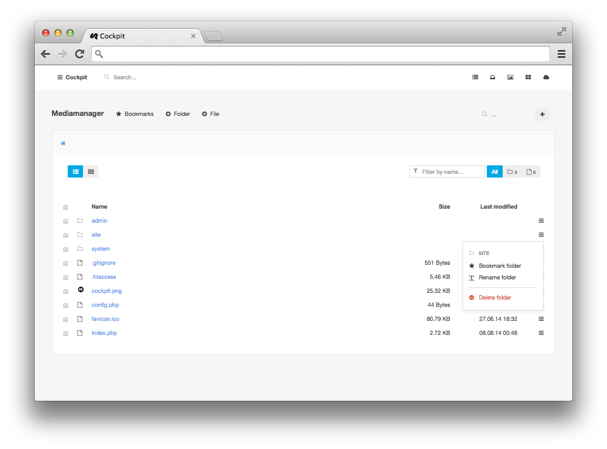
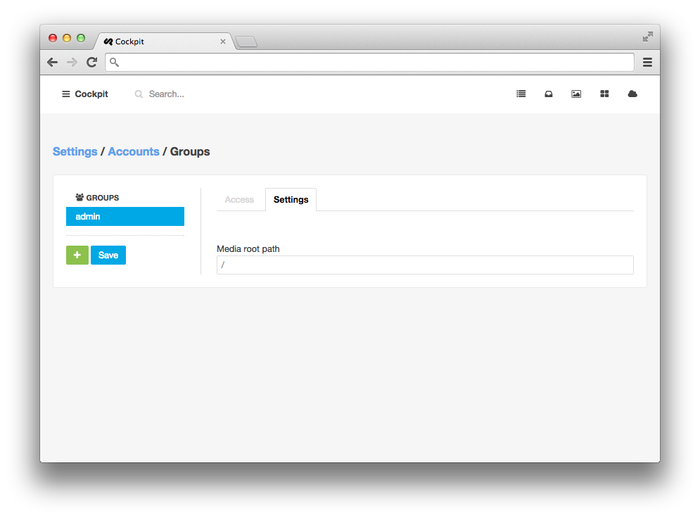

### Mediamanager

Cockpit comes with a complete Mediamanager. **Manage folders and files.** Upload new files by just drag'n drop in the browser window.
**Edit your site code on the fly** (with syntax highliting for js, css, htm, php, ...). Managing the filesystem has never been that easy.




<div class="uk-alert">
    You can change the root path for each user group in <strong>Settings &gt; Accounts</strong> by clicking on <i class="uk-icon-group"></i> __Manage account groups and permissions__ and then switching to the group settings tab.
</div>




---

## Module API

##### thumbnail( $image, $width = null, $height = null, $options=[] )

Get a thumnail url from an $image

```
$thubnail_url = cockpit('mediamanager:thumbnail', 'path/to/anyimage.jpg', 200, 300);
```

```
// height is optional.
// if only width is provided, height is then equal width
cockpit('mediamanager:thumbnail', 'path/to/anyimage.jpg', 200);
```

Options:

```
// thumbnail options are also optional.
cockpit('mediamanager:thumbnail', 'path/to/anyimage.jpg', 200, 300, [...]);
cockpit('mediamanager:thumbnail', 'path/to/anyimage.jpg', 200, [...]);

// possible options with default settings:
[
    "rebuild"     => false,
    "cachefolder" => "cache:thumbs",
    "quality"     => 100,
    "base64"      => false,
    "mode"        => "crop" // available modes: 'crop', 'best_fit', 'resize'
]
```