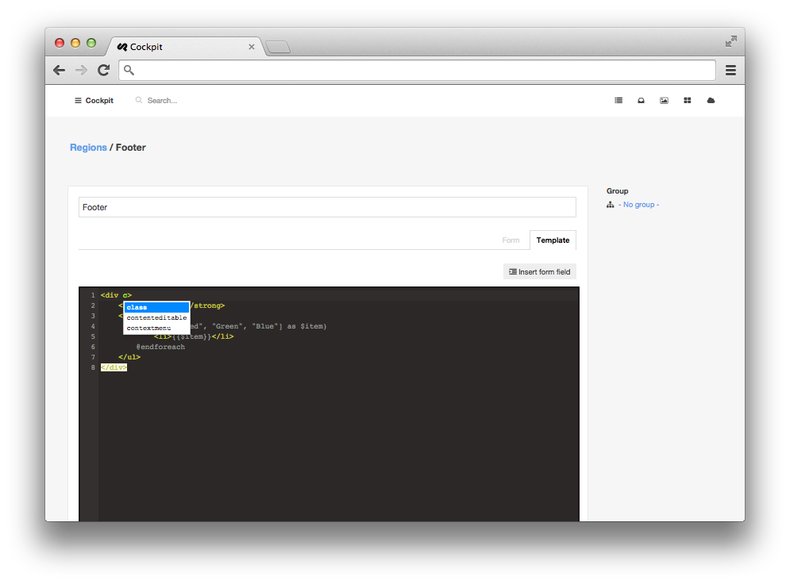
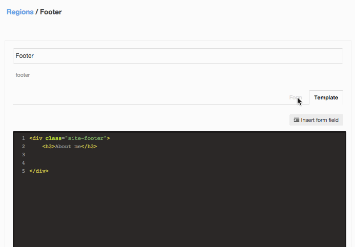

### Regions

Regions are editable content snippets that you can reuse everywhere on your website.





It even comes with a powerful template language called <span class="uk-badge">Lexy</span> (inspired by Blade) to be even more flexible:


    <strong>Colors:</strong>
    <ul>
        @foreach(["Red", "Green", "Blue"] as $item)
            <li>{{$item}}</li>
        @endforeach
    </ul>


<div class="uk-alert">
    Lexy is a superset of PHP. You can also use just plain PHP.
</div>

#### Region fields

Create region fields and reuse them in the region template. Region fields are great to hide code complexity from customers.




Render your regions at any position on your site:

    <?= cockpit('regions')->render('Footer') ?>

    <!-- Or use the shortcut function: -->

    <?= cockpit('regions:render', 'Footer') ?>


---

## Module API

##### get_region( $name )

Get region meta information array

```
// get meta info
$regionmeta = cockpit('regions:get_region', 'Footer'):

// get region fields
$regionfields = $regionmeta['fields'];
```

---

##### get_region_by_slug( $slug )

Get region meta information array by region slug

```
// get meta info
$regionmeta = cockpit('regions:get_region_by_slug', 'footer-at-the-bottom'):
```

---

##### render( $name, $params = [], $locale = null )

Returns output of rendered region template

```
// get meta info
echo cockpit('regions:render', 'Footer'):
```

---

##### region_field( $region, $fieldname, $key = null, $default = null )

Quick access to region fields

```
// get meta info
$fieldmeta = cockpit('regions:region_field', 'Footer', 'aboutme');

// get field value
$aboutme = cockpit('regions:region_field', 'Footer', 'aboutme', 'value');
```

---

##### group( $group, $sort = null )

Get all regions in a group

```
// get meta info
$regions = cockpit('regions:group', 'groupname');
```