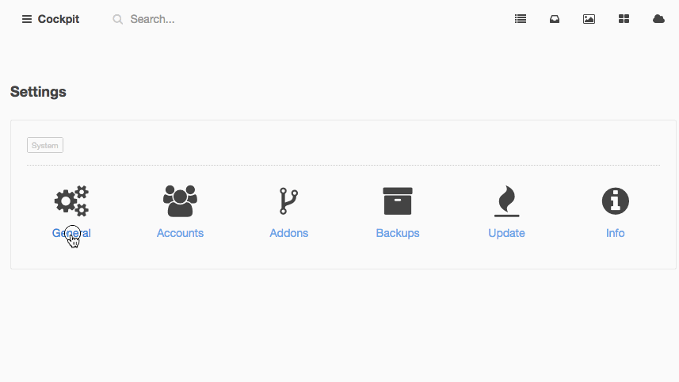
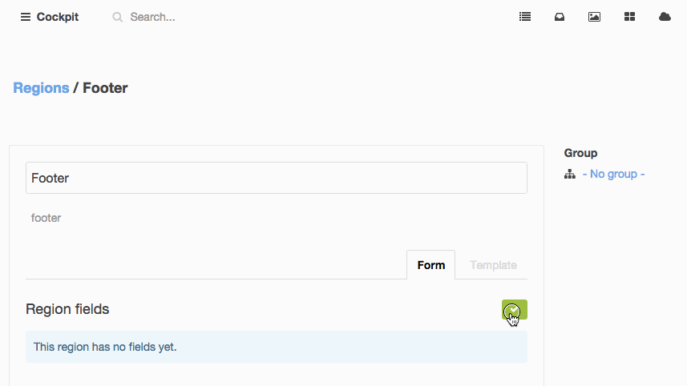

### Multilanguage


#### Step 1

Managing multiple languages is pretty simple. First you need to define which languages you want to use.

Go to **Settings > General** and select some languages.



---

#### Step 2

Now we set the __Localize__ option for the fields we want to localize:




---

#### Step 3

We can now render the region in the language we want:

```
<?= cockpit('regions:render', 'Footer') ?>
<?= cockpit('regions:render', 'Footer', 'cs') ?>
```

If you localized collection fields, the language code is appended to the fieldname.

```
$post = cockpit('collections:collection', 'blog')->findOne(['title_slug'=>'some-topic']);

$post['article'];     // default
$post['article_cs'];  // localized
```